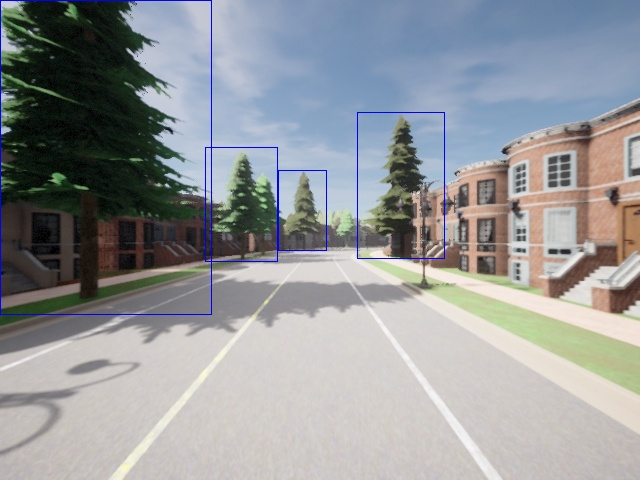
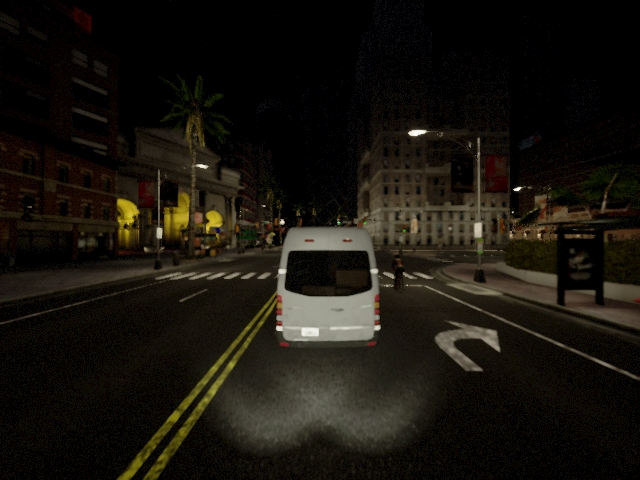
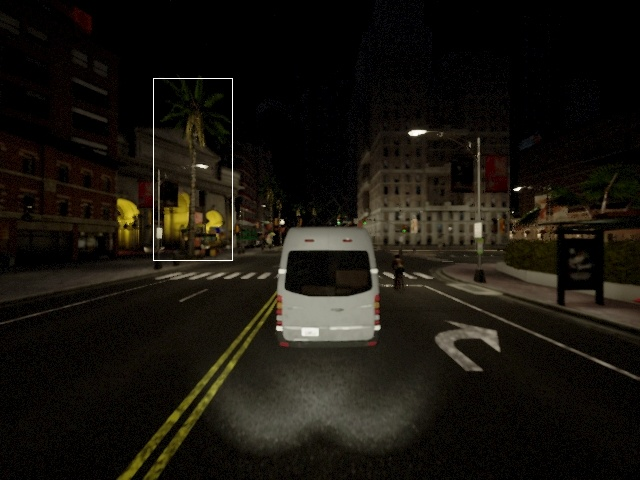

# Beatrees dataset

## Project description
This dataset contains images from different CARLA towns to create a synthetic dataset of front-view trees. It includes images under different weather conditions such as: sunny, nighttime and rain, in which different type of trees can be seen.

It contains 9670 trees instances devided in 2082 images.

Each folder is named after the town where the secuence was recorded and the metheorology condition used. In the following table, the number of images in the different towns can be asses.

<table>
  <thead>
    <tr>
      <th>Town</th>
      <th>Sunny</th>
      <th>Nighttime</th>
      <th>Rain</th>
    </tr>
  </thead>
  <tbody>
    <tr>
      <td>Town 01</td>
      <td>363</td>
      <td>287</td>
      <td>324</td>
    </tr>
    <tr>
      <td>Town 03</td>
      <td>188</td>
      <td>0</td>
      <td>0</td>
    </tr>
    <tr>
      <td>Town 05</td>
      <td>282</td>
      <td>107</td>
      <td>0</td>
    </tr>
    <tr>
      <td>Town 10</td>
      <td>325</td>
      <td>206</td>
      <td>0</td>
    </tr>
  </tbody>
</table>

### Preview of the dataset

## Annotations format
The annotation files are constructed with the Yolo format, each annotation file contains information of the class (always 0 as all the trees are marked under the same tag), x-axis center position, y-axis center position, width and height. 

## How to access the data?
/beatrees/town_xx_vx_xxxxx/annotations ---> Contains the annotations of all the images

/beatrees/town_xx_vx_xxxxx/annotations_norm ---> Contains the annotations normalised in yolo format

/beatrees/town_xx_vx_xxxxx/images ---> Contains the image of the secuence
